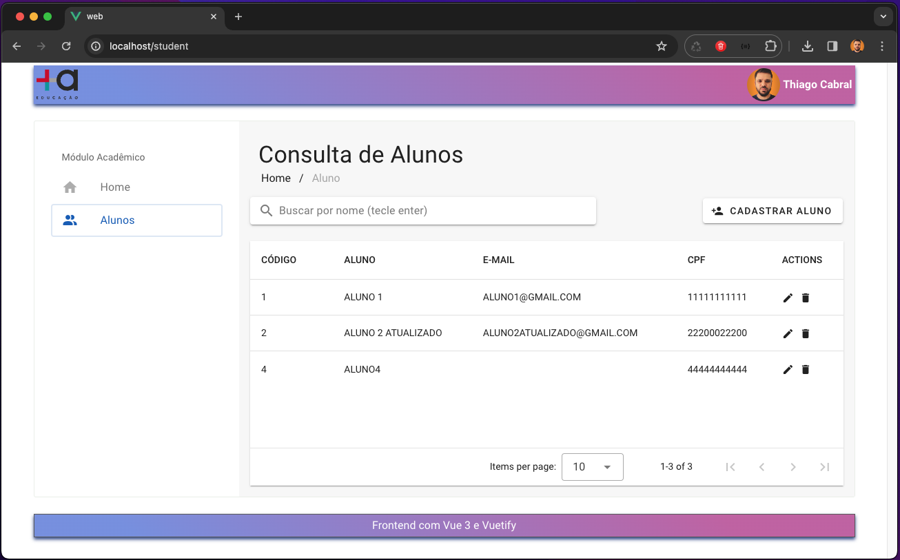

# Comentário do Desenvolvedor

O seguinte código desenvolvido resolve o desafio aplicado pela empresa **+A Educação** para vaga de **Desenvolvedor Full Stack Node**.

## Decisão da arquitetura utilizada

O código foram separados em três pastas.

Diretório   | Descrição
--------- | ------
mysql | Diretório que será mapeado para o serviço de banco de dados MySQL for iniciado pelo Docker;
api | Contém o código do backend;
web | Contém o código do frontend;


## Iniciar os Serviços

1. Clone este repositório;

2. Na raiz do projeto execute o comando ```sudo ./start.sh```. Se apresentar erro permission denied execute o comando ```chmod +x start.sh``` e tente novamente. Se o error persistir, tente ```docker-compose up -d --build```;

3. O endereço do frontend WEB é http://localhost e da API http://localhost:3000. 


## Serviço de Banco de Dados
O banco de dados escolhido foi o [MySQL](https://www.mysql.com/). Após subir os serviços docker, as credenciais de acesso estão disponíveis no arquivo [.env](./.env). Em um projeto real não devemos versionar este arquivo por questão de seguraça. Nesse contexto, optei por versionar para que seja possível executar os serviços sem a necessidade de configurar e/ou criar arquivos.


## Serviço de API (Backend)
Conforme requisito, a *Application Programming Interface* (API) foi desenvolvido em [NodeJS](https://nodejs.org/en) com biblioteca [ExpressJS](https://expressjs.com/). A seguir listamos as bibliotecas usadas no projeto:

Biblioteca   | Descrição
--------- | ------
[ExpressJS](https://expressjs.com/) | É um framework para [NodeJS](https://nodejs.org/en) que possibilita a criação de servidores *Representational State Transfer* (REST).
[MySQL](https://www.npmjs.com/package/mysql) | Drive para se trabalhar com banco de dados [MySQL](https://www.mysql.com/);
[knexjs](knexjs.org) | É um *query builder* compatível com vários banco de dados capaz de facilitar interação com bancos de dados relacionais além de implementar *migrations*;
[JestJS](https://jestjs.io/pt-BR/) | Framework de Testes em JavaScript. Permite a prática de desenvolvimento usando *Test Driven Development* (TDD).
[SuperTest](https://github.com/ladjs/supertest) | Biblioteca capaz de realizar testes de integração de APIs HTTP. 
[FakerJS](https://fakerjs.dev) | Biblioteca usado para gerar dados falso para rotina de testes;
[cors](https://www.npmjs.com/package/cors) | Biblioteca que permite que recursos restritos em uma página/API sejam acessados ​​de outro domínio habilitando o [*Cross-origin resource sharing* (CORS)](https://en.wikipedia.org/wiki/Cross-origin_resource_sharing);
[http-status-codes](https://www.npmjs.com/package/http-status-codes) | Biblioteca de contantes com códigos de status HTTP para uma melhor organização;

No código da API foi usado o TypeScript que implementa a tipagem forte para escrita JavaScript.
Com o uso do [knexjs](knexjs.org) implementamos *migrations* que possibilita mapear mudanças na estrutura do banco de dados e aplicar em tempo de execução, além de possibilitar a troca do banco de dados usado sem muito trabalho.

Foi criado um middlewares [xss_sanitize.js](./api/src/middlewares/xss_sanitize.js) que faz uma limpeza removendo código javascripts enviados pelo usuário a fim de evitar ataque *Cross-site scripting* (XSS). Mais detalhes em [https://www.kaspersky.com.br/resource-center/definitions/what-is-a-cross-site-scripting-attack](https://www.kaspersky.com.br/resource-center/definitions/what-is-a-cross-site-scripting-attack)

Comandos da API:
- ```npm install```: Para instalar as bibliotecas necessárias;
- ```npm run dev```: Permite executar o serviço da API em modo de desenvolvimento;
- ```npm run test```: Permite executar os testes. Não cobri todas as rotas com testes, tampouco testes unitários por questão do tempo.


## Serviço de WEB (Frontend)
Usamos [VueJS](https://vuejs.org/) com [VuetifyJS](https://vuetifyjs.com) conforme requisito. A seguir listamos as bibliotecas usadas na camada de *frontend* da aplicação:

Biblioteca   | Descrição
--------- | ------
[VueJS](https://vuejs.org/) | Framework para a construção de interfaces de usuário;
[VuetifyJS](https://vuetifyjs.com) | Estrutura de componentes para [VueJS](https://vuejs.org/);
[vue-router](https://router.vuejs.org/) | É um gerenciador de rotas oficial para [VueJS](https://vuejs.org/);
[vue3-toastify](https://github.com/jerrywu001/vue3-toastify) | Componente "toast" para [VueJS](https://vuejs.org/);
[vuetify-use-dialog](https://github.com/wobsoriano/vuetify-use-dialog) | Módulo que simplifica a criação de diálogos no [VuetifyJS](https://vuetifyjs.com);

Comandos da WEB:
- ```npm install```: Para instalar as bibliotecas necessárias;
- ```npm run serve```: Permite executar o serviço da WEB em modo de desenvolvimento; 
- ```npm run build```: Gerar o bundler da aplicação web na pasta **dist**;

Os arquivos foram separados de acordo com sua funcionalidades:
- assets: Recursos como imagens usadas no projeto;
- components: Pequenos pedaços de interface que podem ser importados e usados pelas páginas;
- pages: São páginas que serão apresentados pelas rotas;
- error: Módulos com mapeamento de mensagens de erros;
- router: Configurações de rotas da aplicação;
- services: Módulo que faz chamadas a API;


# O que não foi implementado e/ou poderia melhorar?
- Criar a documentação da API com [swagger]([https://swagger.io/);

- Autenticação usando [JWT](https://jwt.io/). Tem exemplo de implementação no meu repositório [Github](https://github.com/t7cabral/w2bit-teste);

- Criar serviço para notificar e atualizar o frontend usando [socket.io](socket.io) e [RabbitMQ](https://rabbitmq.com/);

- Cobrir em 100% a API e frontend WEB com testes unitários e de integração;

- Hospedar a aplicação na Amazon usando o serviço EC2;

# Vídeo demonstrativo
[](./apresentacao.mp4)

Obrigado,
Fim!